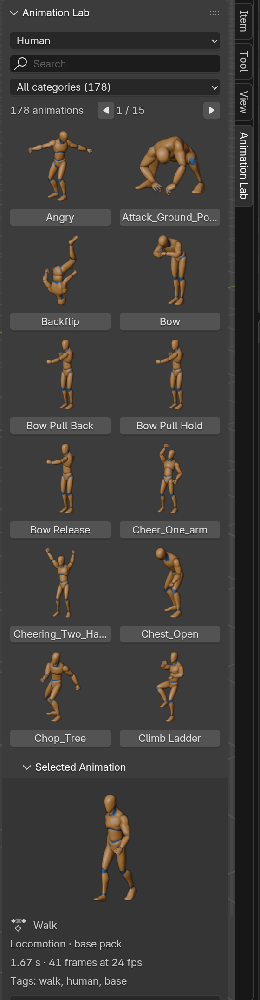
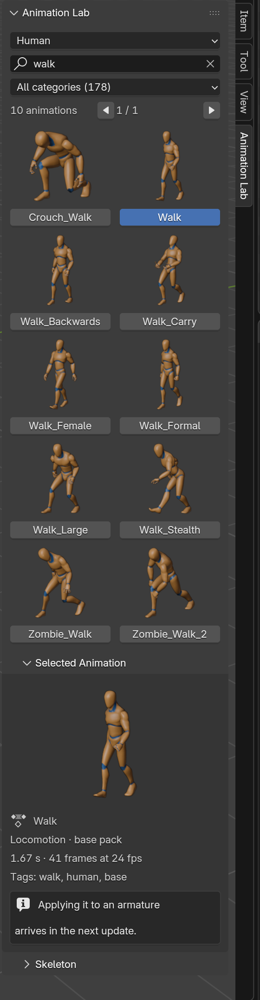

# AL4: The animation browser

**Status:** ✅ Done
**Date:** 2026-10-08
**Previous:** [AL3-addon-skeleton.md](AL3-addon-skeleton.md)

## Goal

Browse the library inside Blender: a thumbnail grid in the Animation Lab tab, with **search**, **skeleton** and **category** filters, and **selecting** an animation to see its details.

## Result: what it looks like (real Blender 4.5 window)

| As it opens | Search "walk", Walk selected |
|---|---|
|  |  |

- **Skeleton** dropdown (9 skeletons), **Search** field (filters while typing), **Category** dropdown with counts
- **Result count and paging:** "178 animations · ◀ 1 / 15 ▶"
- **Thumbnail grid:** a page at a time (12 by default). Each cell is the thumbnail from AL2 plus a button with the name. The selected animation's button is highlighted.
- **Selected Animation** sub-panel: larger preview, name, category and pack, length in seconds, frames and frame rate, root motion (when it has it), tags
- **Skeleton** sub-panel (closed by default): rig thumbnail, number of animations, rig name and bone count, Reload
- Button tooltips show the full name, category and length (long names are shortened with "…" in the grid)

**Search** matches every word typed against the name, category and tags: `walk` gives 10 human clips, `sword attack` both words, `mocap` the 16 motion-capture clips (the pack name is a tag). Changing skeleton, category or search **goes back to page 1**; changing skeleton **clears the selection**.

**Preferences:** Thumbnail Size (default 4.5) and Animations per Page (default 12, 4–48).

## Code changes (`Animation-Lab-add-on/animation_lab/`)

| File | Change |
|---|---|
| `library.py` | `search()` (word-by-word over name, category, tags), `animation(id)`, `page_count()`, `page_of()` |
| `properties.py` | State gets `search` (filters while typing), `page`, `selected`; filter changes reset the page; skeleton change clears the selection; `filtered_animations()` |
| `operators.py` | `animation_lab.select_animation` (tooltip shows the animation), `animation_lab.change_page` (stops at the first and last page) |
| `ui.py` | Three panels: **browser** (`ANIMLAB_PT_library`), **Selected Animation** (`ANIMLAB_PT_selection`), **Skeleton** (`ANIMLAB_PT_skeleton`, closed by default) |
| `preferences.py` | Thumbnail size default 4.5 (grid), new Animations per Page |
| `previews.py` | Loads each thumbnail fully when first shown (see below) |

## Tests

**Add-on tests: 13/13** (`tests/run_addon_tests.sh`, on the installed zip). New or extended:

| Test | Checks |
|---|---|
| Panel draws | "178 animations", "1 / 15", 12 thumbnails with select buttons, search field. Every button property set by the panel (`animation_id`, `step`) is checked against the operator's real definition. |
| Search | `walk` includes Walk and Crouch_Walk, `sword attack` needs both words, `mocap` gives 16, category + search, no results, fox has 14 |
| Browser shows search results | Only matching thumbnails; "No animations match" when nothing does |
| Paging | Can't go before page 1 or past page 15; the last page shows the last 2; a new search starts at page 1; 4 per page gives 45 pages |
| Selecting an animation | Details panel empty until something is selected, then "Walk", "Locomotion · base pack", "1.67 s · 41 frames at 24 fps"; only the selected button is drawn pressed; unknown ids are refused; changing skeleton clears the selection |
| Skeleton panel | "178 animations", "Human Rig, 66 bones" |

**Library tests:** 10/10, unchanged.

**Real UI check (new, manual):** `tests/take_ui_screenshot.sh shot.png [search]` installs the add-on into a throwaway Blender user folder, opens Blender **with a window** for a few seconds, shows the Animation Lab tab and saves a screenshot. The pictures above come from it. It's manual because it opens a window; the automated tests stay headless.

## Found with the real-window check

| Finding | Fix |
|---|---|
| In a real window every thumbnail showed a **loading spinner** instead of the picture. Blender loads preview images lazily and only finishes when something asks for their pixels. | `previews.icon_id()` reads the image size right after loading, which loads it at once. Thumbnails appear immediately (screenshots above). |
| **Two ✕ buttons** next to the search field: Blender already puts a clear button inside search fields | Removed my extra button and its operator |

Neither would have shown up in headless tests: there, Blender gives no icons and draws no panels.

## Notes for AL5
- The Selected Animation panel is where the **Import Rig**, **Apply to Selected Armature** and **Push to NLA** buttons go.
- `library.file_path(entry["blend_file"])` + `entry["action"]` identify the action to append; `entry["fps"]` is the rate to play it at.
