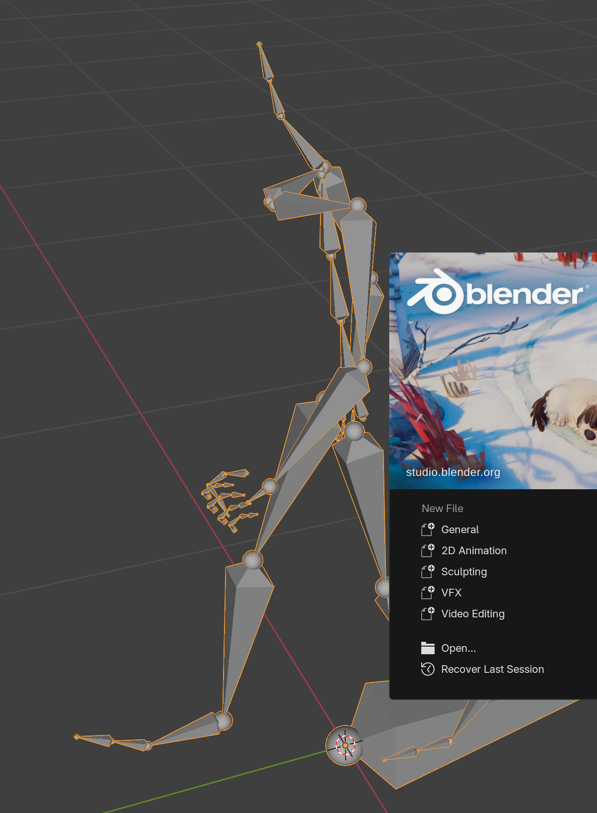

# AL5: Import rig and apply animations

**Status:** ✅ Done. **The Animation Lab MVP is complete.**
**Date:** 2026-10-08
**Previous:** [AL4-browser-ui.md](AL4-browser-ui.md)

## Goal

Use the animations: import a skeleton's rig, apply an animation to the selected armature, push it into the NLA Editor, and optionally mirror it, playing each clip at its correct speed.

## Result

In the **Selected Animation** panel:

```
┌ Selected Animation ────────────────────┐
│        [ thumbnail ]                   │
│ Walk · Locomotion · base pack          │
│ 1.67 s · 41 frames at 24 fps · tags…   │
│ ┌────────────────────────────────────┐ │
│ │ ✓ Human Rig: 66/66 bones match     │ │
│ │ [ Import Rig ]                     │ │
│ │ [□ Mirror]                         │ │
│ │ [ Apply ] [ Push to NLA ]          │ │
│ └────────────────────────────────────┘ │
└────────────────────────────────────────┘
```

| Feature | Behaviour |
|---|---|
| **Import Rig** | Appends the skeleton's clean rig at the **3D cursor**, selected and active. Also in the Skeleton panel. |
| **Apply** | Sets the clip as the active armature's **action** (slot assigned) |
| **Push to NLA** | Adds the clip as an **NLA strip at the current frame** on the "Animation Lab" track; when that spot is taken, a new track |
| **Mirror** | Swaps left and right; the clip is named "… (mirrored)" |
| **Frame rate** | Clips are **retimed to the scene's frame rate** so they play at real speed (24 fps Walk in a 30 fps scene → 50 frames). Preference *Match Scene Frame Rate* (on by default). |
| **Compatibility** | The panel shows how well the active armature matches ("66/66 bones match"). Armatures without the skeleton's position bone, or with less than half of its bones, are **refused** with a message (e.g. a Mixamo rig: that's AL7). Simplified-hand rigs still work; missing fingers just aren't animated. |
| **Copies, not links** | Rigs and actions are appended, so the file works without the add-on. Their asset marks are cleared (the user's file doesn't become an asset library). Applying the same clip again **reuses** the copy (one per frame rate and mirroring). |

### Real Blender window
Imported Human Rig, Walk applied, frame 20 (mid-stride):



## Mirror accuracy

The mirror uses Blender's X-mirror convention (the same as *Paste Flipped Pose*): keys move to the opposite side's bone, location X and rotation Y/Z flip sign. That's exact only if the rig is symmetric, so it was measured before building the UI: mirrored clip vs the original reflected across X, every joint, every 3rd frame:

| Skeleton | Clips | Worst joint difference |
|---|---|---|
| Human | Walk, Punch_Jab, Sword_Attack | 0.001 mm |
| Spider | Attack | 0.001 mm |
| Fox | Run, Bark | 0.051 mm |
| Horse | Run | 0.075 mm |

Side naming handled: `_l/_r`, `_L/_R`, `.L/.R`, and `_L_`/`_R_` inside names.

## Code (`Animation-Lab-add-on/animation_lab/`)

| File | Change |
|---|---|
| `apply.py` (new) | `import_rig`, `get_action` (append + reuse + retime + mirror), `retime`, `mirror`, `mirror_bone_name`, `assign`, `push_to_nla`, `compatibility` |
| `operators.py` | `animation_lab.import_rig`; `animation_lab.apply_animation` (mode Action or NLA; poll explains what's missing; refuses incompatible armatures) |
| `ui.py` | Apply controls in Selected Animation (match status, Import Rig, Mirror, Apply, Push to NLA); Import Rig in the Skeleton panel |
| `properties.py` | `mirror` toggle |
| `preferences.py` | *Match Scene Frame Rate* |
| `tools/build_library/build_library.py` | Catalog skeletons now carry `bone_names` and `position_bone` (used by the compatibility check) |

## Tests: add-on 22/22 (+9), library 10/10

| Test | Checks |
|---|---|
| Import rig | 66-bone "Human Rig" at the cursor (1, 2, 0), active and selected, no asset mark; a second import adds a second rig |
| Apply as active action | Action "Walk" with slot, fps 24, frames 0–40, no asset mark; the pose changes over the clip; applying again **reuses** the action |
| **Retimed to the scene frame rate** | In a 30 fps scene Walk becomes frames 0–50; joints at scene frame 25 equal the 24 fps version's joints at frame 20 (the same 0.833 s) within 0.01 mm; one copy per frame rate |
| Frame rate matching off | Keeps frames 0–40 at 24 fps |
| Push to NLA | Strip at frame 10 on "Animation Lab" with slot; same spot → second track; frame 100 → back on the first track |
| **Mirror** | Walk and the root-motion clip Dodge_left_RM: every joint matches the reflection within 0.1 mm; named "(mirrored)" |
| Refuses other armatures | A non-Mesh2Motion armature: error, and nothing is added to the file |
| Needs an animation and an armature | Apply is disabled without an armature or without a selection |
| Selection panel with an armature | "Human Rig: 66/66 bones match", Apply and Push to NLA buttons, Mirror toggle |

## Found along the way
| Finding | Fix |
|---|---|
| The screenshot tool **hung and left a Blender window open** when one step failed (the 3D "view selected" call needs the 3D view's region) | Step errors are now printed and Blender quits; a step limit; a **120 s watchdog** in the shell script; the region is passed correctly |
| Actions' slots are named after the library rig ("Human Rig"); armatures with other names wouldn't pick up the slot automatically | `assign` and `push_to_nla` set the slot explicitly |

## MVP status

| Phase | Status |
|---|---|
| AL1 library | ✅ |
| AL2 thumbnails | ✅ |
| AL3 add-on | ✅ |
| AL4 browser | ✅ |
| AL5 import + apply | ✅ |
| AL6 viewport preview | next (optional) |
| AL7 Mixamo mode | later |
| AL8 tests/CI/release | later |

## How to try it
1. Use `Animation-Lab-add-on/dist/animation_lab-0.1.0.zip` (rebuilt with AL5). In Blender, remove the old version first (*Edit → Preferences → Add-ons*), then drag the new zip in.
2. **N** → Animation Lab → **Import Rig** → click an animation → **Apply** → press Play (space).
3. Try **Push to NLA** at different frames to chain clips, and **Mirror**.
