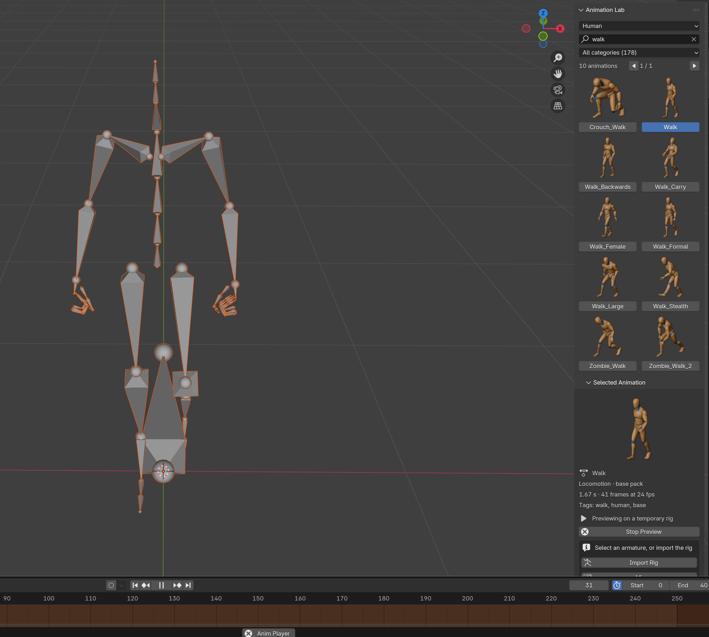

# AL6: Viewport preview

**Status:** ✅ Done
**Date:** 2026-10-08
**Previous:** [AL5-import-and-apply.md](AL5-import-and-apply.md)

## Goal

Watch an animation play in the viewport **before** applying it, without leaving anything behind in the user's scene or file.

## Result

| | |
|---|---|
| Where | **Preview** button in the Selected Animation panel; while it runs: "▶ Previewing on …" and **Stop Preview** |
| What it plays on | The **active armature** when it matches the skeleton, so you see the motion on your own character. Otherwise a **temporary rig** at the 3D cursor, drawn in front. |
| Playback | Loops just the clip, using Blender's **preview range**; plays at the right speed (same frame-rate retiming as Apply); honours **Mirror** |
| Switching | Clicking another animation while previewing plays that one immediately |
| Stop Preview puts back | the armature's previous action and slot (or no animation at all), its pose, the scene's preview range (on/off, start, end) and the current frame. The temporary rig and its armature data are removed. |
| Stops by itself | when you **Apply** (so the old action isn't put back over the new one), **before saving** (it never ends up in the file), **when opening another file**, and **when the add-on is disabled** |

### Real Blender window
Preview of Walk on a temporary rig, playing (frame 31 of the 0–40 loop):

The screenshot tool reported: *preview started at frame 0, playing; at the screenshot frame 31, still playing.*

## Code (`Animation-Lab-add-on/animation_lab/`)

| File | Change |
|---|---|
| `preview.py` (new) | Preview session: `start`, `switch`, `stop` (puts back what it changed), temporary rig, `save_pre` / `load_pre` handlers, cleanup on unregister |
| `operators.py` | `animation_lab.preview_start`, `animation_lab.preview_stop`; selecting an animation switches a running preview; Apply stops it first |
| `ui.py` | Preview / Stop Preview controls with what the preview plays on |
| `__init__.py` | Registers the preview module last, so it unregisters (and stops a running preview) first |

## Tests: add-on 29/29 (+7), library 10/10

| Test | Checks |
|---|---|
| **Preview on a matching armature puts everything back** | Plays Walk on the user's rig, preview range set to the clip (0–40). After Stop: no animation again (as before), the user's hand-set pose restored, the preview range (off, 5–60) and frame 7 restored |
| Gives back the previous action | A rig with Jog applied previews Walk, then has Jog (and its slot) back |
| Temporary rig | With no armature selected: a temporary rig, drawn in front; after Stop the object **and** its armature data are gone |
| Clicking another animation switches | Walk → Jog while previewing; Mirror gives "Jog (mirrored)" |
| Apply ends the preview | The applied Walk stays (not undone by the preview stopping) |
| Stops before saving | The save handler stops the preview and removes the temporary rig |
| Preview controls in the panel | "Preview" button; while running "Previewing on Human Rig" and "Stop Preview" |
| Disable and enable (extended) | Disabling the add-on during a preview removes the temporary rig |

**Real-window check:** `tests/take_ui_screenshot.sh shot.png walk preview`. Playback can only run with a window, so this is the check that it really plays.

## Found along the way

| Finding | Fix |
|---|---|
| **Blender quirk:** while the preview range is switched off, setting its start and end disturbs each other (setting 5–60 gave 1–60, then 5–250) | Restore with the range switched on (start, end, start again), then put the on/off switch back. Probed in Blender for normal, later-than-end and short ranges. |
| Restoring the pose normalises quaternions | The test now sets a unit quaternion (the pose was always restored correctly) |
| The splash screen hid the preview rig in the screenshot | The screenshot tool turns off the splash in its throwaway user folder and frames the rig |

## What's left
| Phase | |
|---|---|
| AL7 Mixamo mode | Apply onto a Mixamo armature already in the scene, with the Mixamo converter |
| AL8 Tests, CI, release | GitHub Actions, release download, extensions.blender.org |
