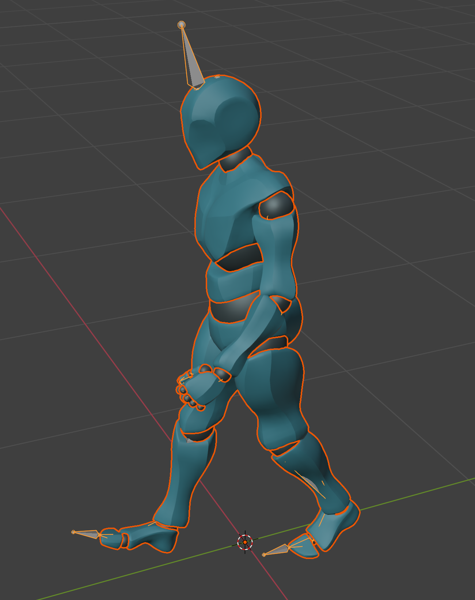

# AL7: Mixamo mode

**Status:** ✅ Done
**Date:** 2026-10-08
**Previous:** [AL6-viewport-preview.md](AL6-viewport-preview.md)

## Goal

Apply Mesh2Motion **Human** animations directly to a **Mixamo armature already in the scene** (Y Bot or any Mixamo character), so they line up with Mixamo clips in the NLA Editor, **without shipping Mixamo data** in the add-on.

## Result

Select a Mixamo armature, pick a Human animation, and **Apply**, **Push to NLA**, **Mirror** and **Preview** all work. The panel shows *"Armature: Mixamo rig: 65/65 bones, converted"*.

### Real Blender window: Walk on your Y Bot (frame 25)

## How it works (`animation_lab/mixamo.py`)

Mixamo bones have different rest axes from Mesh2Motion bones, and Blender plays keys relative to each bone's rest, so the keys are **converted**, not renamed:

1. A temporary copy of the library's Human rig plays the animation; **Blender itself evaluates it** for every frame.
2. Each Mixamo bone gets the **same world rotation change** as its Mesh2Motion bone:
   `W_mixamo(t) = W_m2m(t) · O`, with the constant offset `O = W_m2m_rest⁻¹ · W_mixamo_rest`.
3. **Hips** also carries the movement, scaled by the ratio of the two hip heights, so feet stay on the ground on taller or shorter characters.
4. The result is written as a normal **action on the user's armature** (quaternion keys, one per frame, kept in one hemisphere; Hips location keys), with a slot for that armature.

Details:
- **The target is the user's armature**, whatever its proportions and object transform (Mixamo imports come in at scale 0.01, rotated 90°; the maths works in world space).
- **Detection:** at least 80% of Mixamo's 18 core bones, the same rule as the web app's `MixamoMapper`. Accepted names: `mixamorig:Hips`, `mixamorig1:Hips`, `mixamorig_Hips`, `mixamorigHips`, `Hips`.
- **Bone table:** the 65 Mesh2Motion → Mixamo pairs are **generated from the web app's `MixamoMapper.ts`**, so the two can't drift apart.
- **Reuse:** one converted action per armature, frame rate and mirroring.
- **Human only:** animations of other skeletons are refused on a Mixamo armature.
- Converting Walk onto Y Bot takes **0.44 s**.

## Verification

| Check | Result |
|---|---|
| **The rule on your Y Bot:** every Y Bot bone's world rotation change vs its Mesh2Motion bone's | **0.0000°** (automated test, limit 0.01°; runs when the local `Y Bot.fbx` exists) |
| **Axis compensation without Mixamo files:** the library rig renamed to Mixamo names **and** with bones rolled (arms 90°, legs 180°, spine 30°), Sword_Attack converted | every joint where the Mesh2Motion joint is, within **0.01 mm** |
| Same with a root-motion clip (Dodge_left_RM) | within 0.01 mm |
| **Library vs web app, twist included** (three.js playing the cleaned clip on the official rig vs the library in Blender, per-bone world rotation change) | **0.00°** on all 66 bones |
| Real window: Walk on Y Bot (screenshot above) | natural mid-stride; keys 0–50 (24 fps clip retimed to the 30 fps scene) |

## Tests: add-on 38/38 (+9), library 10/10

| Test | Checks |
|---|---|
| Mixamo armatures are recognised | All 5 name styles: 65/65 bones; a Mesh2Motion rig is not taken for Mixamo |
| Converted motion on a Mixamo-named rig | Walk: every joint matches the Mesh2Motion rig |
| **Compensates for different bone axes** | Rolled bones: Sword_Attack still matches joint for joint |
| Root motion on a Mixamo rig | Dodge_left_RM matches, hips travel included |
| Reused and mirrorable | Converted once per armature; "Walk (Mixamo, mirrored)"; Push to NLA uses the converted action |
| Human animations only | A fox animation on a Mixamo rig is refused |
| Preview on a Mixamo rig | Plays the converted action on the Mixamo rig itself, puts everything back after |
| Panel with a Mixamo rig | "Mixamo Test Rig: Mixamo rig: 65/65 bones, converted" |
| Mixamo Y Bot (local only) | Rule within 0.01° on every keyed bone (skipped where the file isn't present) |

## ⚠️ Found: the web app's Mixamo FBX download is off in Blender

While cross-checking AL7 against earlier work, I compared it with the **web app's** Mixamo download (FBX + Blender + Mixamo naming, from I4) on Y Bot. They differed by up to 10.7 cm / 14.4°. Tracking down why:

| Step | Finding |
|---|---|
| Is the library faithful to the web app? | Yes: **0.00°** per bone, twist included |
| Is AL7 faithful to the library? | Yes: **0.0000°** |
| Is the web app's converter right **in three.js**? | Yes: its exported FBX, read back with three.js, follows the rule within **0.11°** |
| Is the web app's file right **in Blender**? | **No:** read by Blender, **46 of 52 bones** break the rule, up to **11.9°** (feet, toes, shoulders) |
| Is that caused by how I built the test? | No: exactly the same numbers for what the **real Download button** produces (standard Mixamo skeleton) |

So the web app's maths is right, but something in how its FBX file is written makes **Blender** read the animation differently from three.js. The likely place is how rotations are written into the FBX curves (`@comfyorg/fbx-exporter-three`: Euler conversion and the absence of PreRotation), but the exact cause isn't pinned down yet.

- **AL7 is not affected:** it writes the action inside Blender, with no FBX round trip.
- **The web app download still "works"** (names, axes, scale and NLA binding are right; see I4), but its motion is a few degrees off at some joints in Blender.
- **Proposed follow-up (web app):** find the exact cause (compare one bone's keys as written vs as read by Blender) and fix the export, then re-run this check, which can become an automated test.

## Files
| File | Change |
|---|---|
| `animation_lab/mixamo.py` (new) | Detection, conversion, reuse, and `action_for` / `can_play_on`, which choose Mixamo mode or the normal library action |
| `animation_lab/operators.py` | Apply uses `action_for`; refuses only when neither mode fits |
| `animation_lab/preview.py` | Previews on a Mixamo rig too (converted) |
| `animation_lab/ui.py` | Mixamo status line |
| `tests/test_addon.py` | 9 Mixamo tests (synthetic Mixamo rigs built from the library rig; Y Bot when available) |
| `tests/ui_screenshot.py`, `take_ui_screenshot.sh` | `mixamo` mode: Walk on the local Y Bot |
